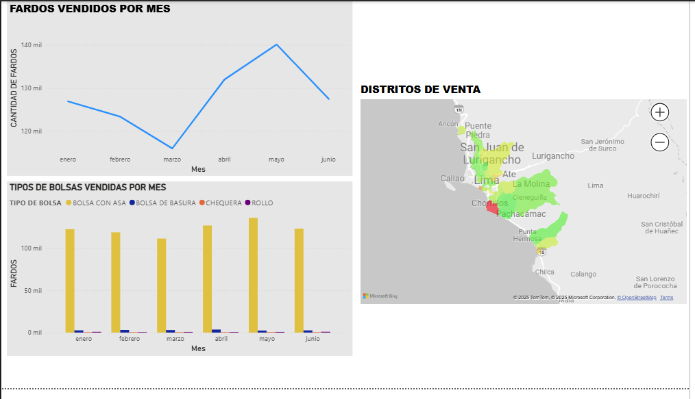

Proyecto PLAST-FENIX

Este proyecto consiste en un **informe de ventas y finanzas** desarrollado a partir de datos procesados en SQL, Python, Excel y visualizados en Power BI.

Tecnologías utilizadas
- **SQL**  creacion de la base de datos usada(TABLES,JOINS),generacion de datos,validacion de datos.  
- **Python** generación de datos  y exportación de datos a Excel.  
- **Excel**  generación de datos en base a datos reales,limpieza y preparación de datos para su analisis.  
- **Power BI** dashboards interactivos (ventas mensuales, utilidades, análisis por distrito, mapa de calor).  

Estructura del repositorio
- `/BASE SQL` → consultas SQL utilizadas.  
- `/EXCEL` → archivos .xlsx  donde se encuentra los datos generados y las formulas que use.  
- `/PYTHON` → codigo usado , librerias usadas(configparser,pysogp2,pandas)
- `/CAPTURAS` → capturas de los reportes y pasos usados para mi proyecto.

## 📸 Ejemplo de dashboard

## 📈 Resultados
- Análisis de ventas mensuales.  
- Cálculo de utilidades (precio - costo).  
- Mapa de calor por distritos en Lima.  
- Visualización de categorías de productos.  

##  Autor
Elmer García Guerrero 
